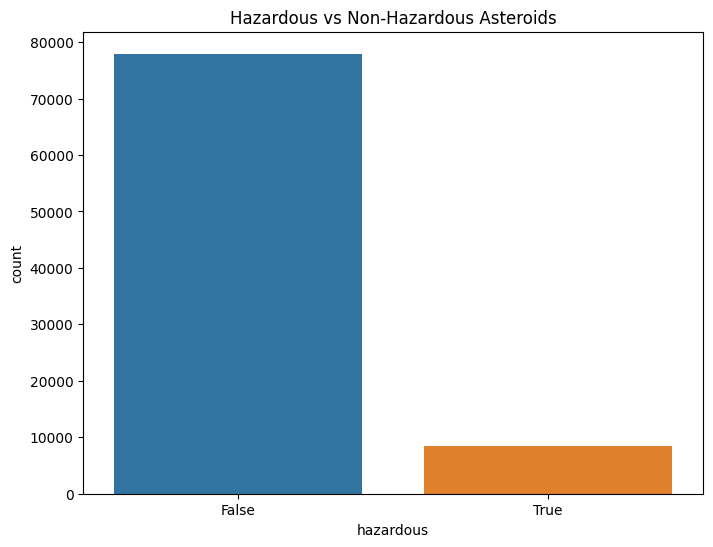
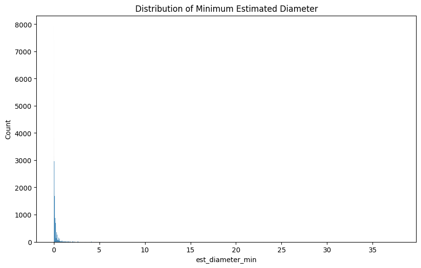
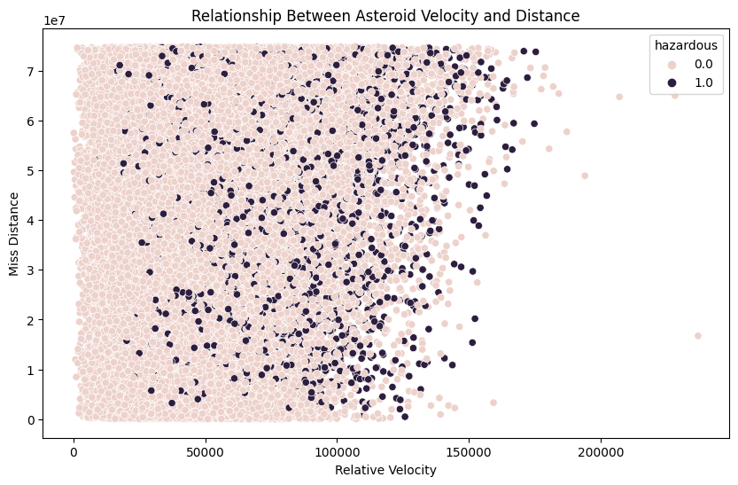
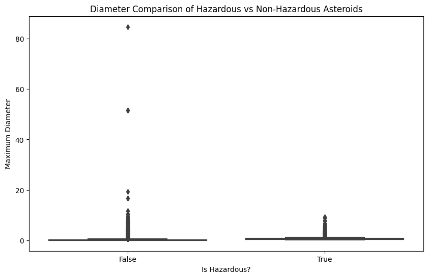
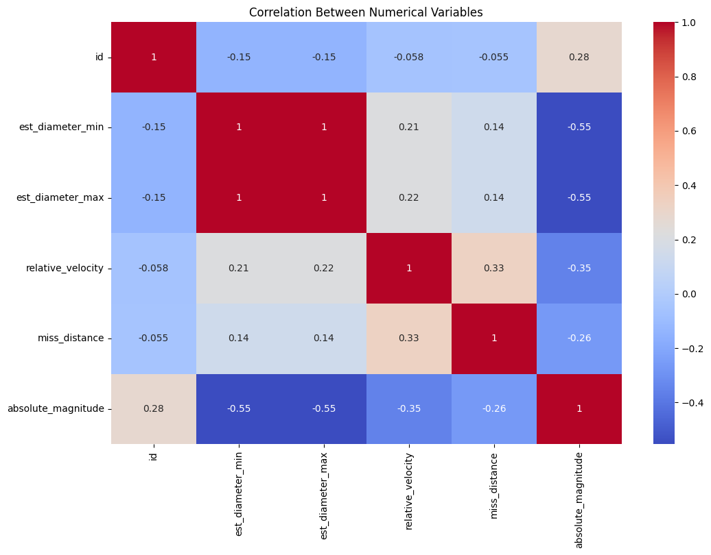

# Aygaz Veri Analizi Projesi

## Proje Hakkında
NASA Near Earth Objects veri seti kullanılarak yapılan veri analizi projesi.
(Kaggle Linki: https://www.kaggle.com/code/yasincanyilmazoglu/earth-objects-aygaz-data-analysis)

## Veri Seti
- Kaynak: Kaggle NASA NEO Dataset (https://www.kaggle.com/datasets/sameepvani/nasa-nearest-earth-objects)
- Boyut: [9.48 MB]
- Değişken Sayısı: [10]
  ['id', 'name', 'est_diameter_min', 'est_diameter_max', 'relative_velocity', 'miss_distance', 'orbiting_body', 'sentry_object', 'absolute_magnitude', 'hazardous']

## Analiz Adımları
1. Veri Ön İşleme
2. Eksik Veri Analizi
3. Görselleştirmeler
4. İstatistiksel Analizler

## Kullanılan Teknolojiler
- Python
- Pandas
- NumPy
- Seaborn
- Matplotlib

## Sonuç ve Öneriler
## Veri Ön İşleme ve Temizleme
Veri setine random NaN değerler eklendi ve sayısal değişkenler için median değerleri kullanılarak eksik veriler dolduruldu.

## Eksik Veri Analizi
### Temizleme Öncesi Eksik Değerler

### Temizleme Sonrası Eksik Değerler

## Görselleştirmeler ve Analizler

### Tehlikeli vs Tehlikesiz Asteroidlerin Dağılımı

### Asteroidlerin Çap Dağılımı Analizi

### Hız ve Mesafe İlişkisi

### Box-Plot Diyagramı ve Analizi

### Korelasyon Analizi

## Sonuç ve Öneriler

### İş Problemi ve Kullanım Senaryoları
Uzay madenciliği ve savunma şirketleri için asteroidlerin tehlike seviyelerini ve potansiyel değerlerini değerlendiren bir risk analiz sistemi geliştirilebilir. Bu sistem:
- Asteroidlerin Dünya'ya çarpma risklerini değerlendirir
- Potansiyel tehlikeli asteroidleri erken tespit eder
- Uzay madenciliği için uygun asteroidleri belirler

### Önerilen ML Çözümü
**Random Forest veya XGBoost Sınıflandırma** algoritması önerilir çünkü:
- Veri setimizde binary sınıflandırma problemi var (hazardous/non-hazardous)
- Çoklu değişken ilişkilerini iyi yakalar
- Sayısal ve kategorik değişkenlerle çalışabilir
- Aykırı değerlere karşı dirençlidir
- Feature importance analizi sağlar

### Kullanılacak Özellikler
- est_diameter_min/max: Asteroid boyutu
- relative_velocity: Göreceli hız
- miss_distance: Dünya'ya olan mesafe
- absolute_magnitude: Parlaklık değeri
